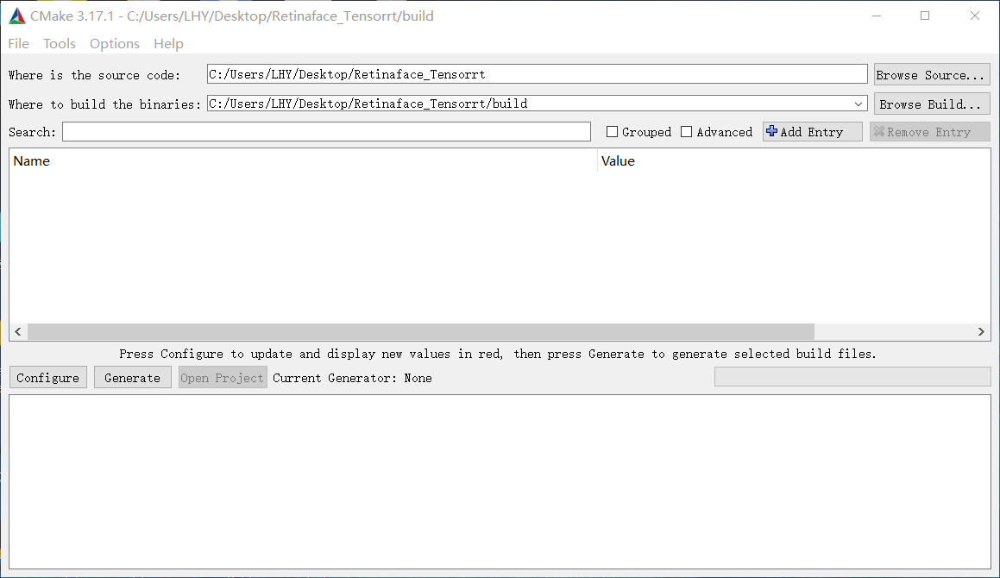
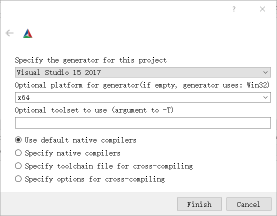
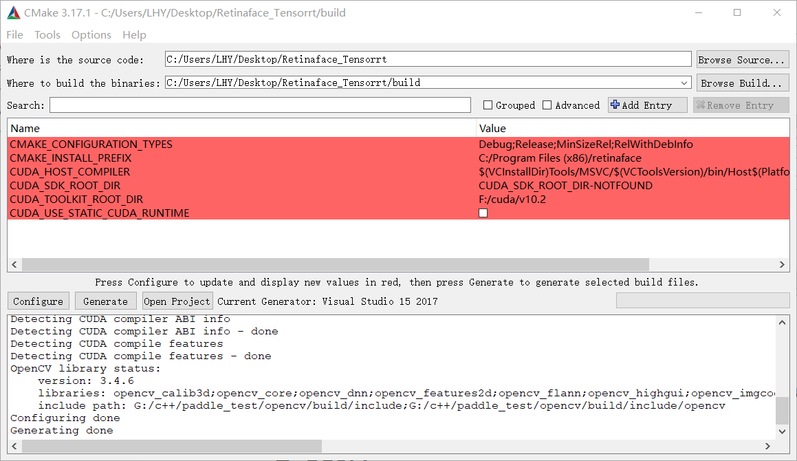
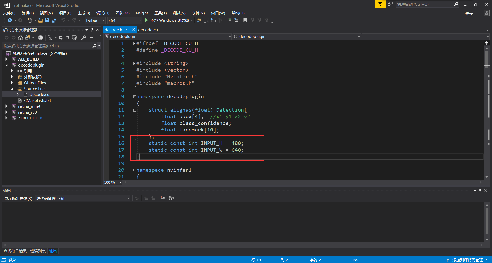
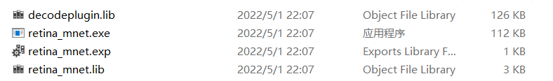
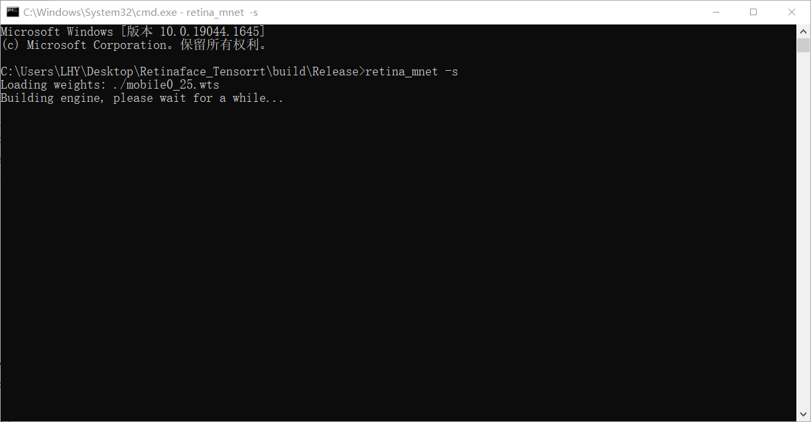
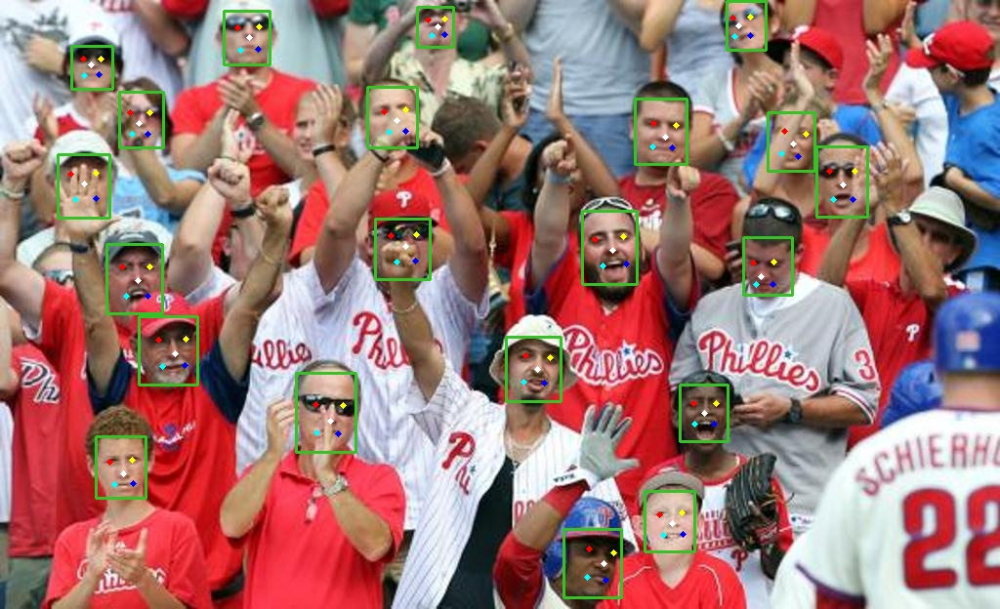
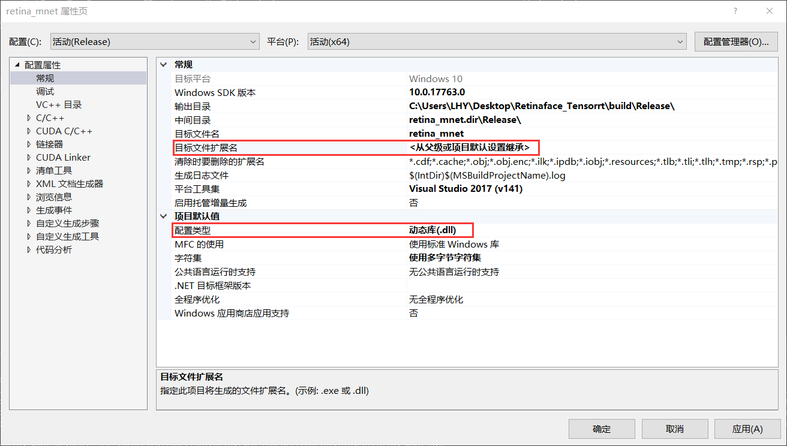
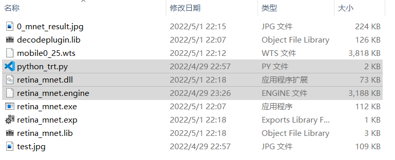

## B站视频教程

[https://www.bilibili.com/video/BV1Nv4y1K727/](https://www.bilibili.com/video/BV1Nv4y1K727/)

## 项目简介

- 基于**Tensorrt**加速**Retinaface**
- 支持**Windows10、Linux**
- 支持**Python/C++**

## 环境说明

- Tensorrt 8.2.1.8
- Cuda 10.2 Cudnn 8.2.1(**特别注意需安装两个cuda10.2补丁**)
- Opencv 3.4.6
- Cmake 3.17.1
- VS 2017
- GTX1650

## 运行案例(Windows)

下载Retinaface仓库和本仓库，权重文件链接https://pan.baidu.com/s/12nl4d_oKrj2aLXEKYcwxiQ 提取码：l7ls

```
git clone https://github.com/biubug6/Pytorch_Retinaface
git clone https://github.com/Monday-Leo/Retinaface_Tensorrt
```

### 生成WTS模型

将仓库中的**gen_wts.py**和刚才下载好的权重文件拷贝至Pytorch_Retinaface的目录下

```
parser = argparse.ArgumentParser(description='Retinaface')
parser.add_argument('-m', '--trained_model', default='./weights/mobilenet0.25_Final.pth',type=str)
parser.add_argument('--network', default='mobile0.25', help='mobile0.25 or resnet50')
args = parser.parse_args()
```

修改default参数，指定权重路径和模型类型，**mobile0.25**或**resnet50**

```
python gen_wts.py
```

生成**mobile0_25.wts**或**resnet50.wts**模型

### 配置C++依赖

**Opencv**、**Tensorrt**如果已经安装完成，可以跳过下述步骤。

#### Opencv配置方法

1、在OpenCV官网下载适用于Windows平台的3.4.6版本 [下载地址](https://bj.bcebos.com/paddleseg/deploy/opencv-3.4.6-vc14_vc15.exe)

2、运行下载的可执行文件，将OpenCV解压至指定目录，例如 `D:\projects\opencv`

3、我的电脑->属性->高级系统设置->环境变量，在系统变量中找到Path（如没有，自行创建），并双击编辑，将opencv路径填入并保存，如`D:\projects\opencv\build\x64\vc15\bin`

#### Tensorrt配置方法

1、在tensorrt官网下载适用于Windows平台的版本 [下载地址](https://developer.nvidia.com/nvidia-tensorrt-download)

2、将TensorRT/lib下所有lib复制到cuda/v10.2/lib/x64下，将TensorRT/lib下所有dll复制到cuda/v10.2/bin下,将TensorRT/include下所有.h文件复制到cuda/v10.2/include下

3、我的电脑->属性->高级系统设置->环境变量，在系统变量中找到Path（如没有，自行创建），并双击编辑，将TensorRT/lib路径填入并保存，如`G:\c++\TensorRT-8.2.1.8\lib`

### Cmake

打开本仓库的**CMakeLists.txt**，修改**Opencv**、**Tensorrt**的目录

```
set(OpenCV_DIR "G:\\c++\\paddle_test\\opencv\\build")
set(TRT_DIR "G:\\c++\\TensorRT-8.2.1.8")
```

在本仓库目录下新建一个**build**文件夹,打开Cmake,选择本仓库目录，以及新建的**build**目录，再点击左下方**configure**按钮。

<div align="center">

</div>


选择自己的Visual Studio版本，如2017，第二个框中选择x64，之后点击finish

<div align="center">

</div>


会自动加载CMakeLists.txt，添加库，正常运行如下

<div align="center">

</div>

若出现红色警告，则需要修改框中信息。例如，**未找到cuda目录，则需要点击上图红色框，添加上自己的cuda路径**，再点击configure。一切正常之后点击generate，最后点击open project。

### 编译

可以在**decode.h**中修改输入图片的尺寸，尺寸越大识别越准，速度越慢，一般保持默认即可。

<div align="center">

</div>

```
static const int INPUT_H = 480;
static const int INPUT_W = 640;
```

将界面上方Debug改为Release，右键**retina_mnet**或**retina_r50**项目，点击重新生成。编译成功后打开build/Release，可以看到生成的exe可执行文件。

<div align="center">

</div>

### C++运行

将第一步生成的wts模型复制到exe的文件夹中，在这个目录下打开cmd输入

```
retina_mnet -s
```

<div align="center">

</div>

正常运行，此时程序在将wts转换为engine序列化模型，需要等待预计**10-20分钟**左右。生成完毕后，将仓库内的pictures/test.jpg复制到文件夹，测试运行

```
retina_mnet -d
```

<div align="center">

</div>

### Python部署

右键工程项目，属性，修改配置类型为**DLL**，然后点击生成，在Release下会生成**retina_mnet.dll**，将仓库内的python_trt.py复制到dll文件夹下。

<div align="center">

</div>

<div align="center">

</div>

设置模型路径，**dll**路径和想要预测的图片路径，**特别注意模型路径需要加b''！！**

```
det = Detector(model_path=b"./retina_mnet.engine",dll_path="./retina_mnet.dll")  # b'' is needed
img = cv2.imread("test.jpg")
```

直接运行**python_trt.py**即可，**python**预测的最大优势在于支持了**numpy**格式的图片，极易融合进项目中。

<div align="center">

</div>

## 参考资料

https://github.com/wang-xinyu/tensorrtx
